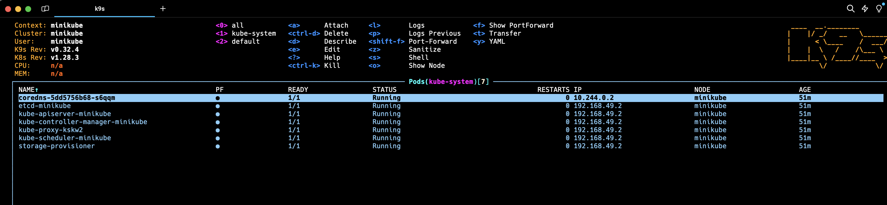

# Minikube

## What is Minikube

Solution to start a Kubernetes (aka. k8s) cluster in local machine

⚠️ TODO: add detail about Minikube architecture ⚠️

### Alternatives solutions

- Kind: https://kind.sigs.k8s.io/
- k3s: https://docs.k3s.io/ (used by Rancher)


## Pre-requisites

Minikube will require `kubectl`. Minikube provide a command `minikube kubectl` that will download `kubectl` if not available.

`kubectl`requires a kubeconfig file to configure the access to the cluster. 

The preference that takes effect while determining which kubeconfig file is used.
1. use --kubeconfig flag, if specified
2. use KUBECONFIG environment variable, if specified
3. use $HOME/.kube/config file

🔴 BE CAREFUL, Minikube will override the `$HOME/.kube/config` file, so if you already have a k8s cluster configured in local, you may need to backup it 🔴

## kubectx / kubens

Tool `kubectx` and `kubens` are useful tool to select cluster and namespace to use by kubectl

**Documentation**: https://github.com/ahmetb/kubectx

```
kubectx minikube
```
is equivalent to 

```
kubectl config use-context minikube
```

`kubectl` command requires to pass the namespace in argument via `-n <my-package>`
It's useful to select the default namespace

```
kubens <namespace>
```
is equivalent to 
```
kubectl config set-context --current --namespace=<namespace>
```

## alias

You may need to create alias to avoid to type `kubectl`. Alias can be added to `$HOME/.zshrc` in order to be available every time you open a zsh terminal (default terminal on MacOS)

```
alias k=kubectl
k get pods
```

## k9s

Spending writing `kubectl` can be cumbersone.
Graphical terminal is available




**Documentation**: https://k9scli.io/


## Setup Minikube

Install Minikube: https://minikube.sigs.k8s.io/docs/start/

Start cluster

```
minikube start
```


