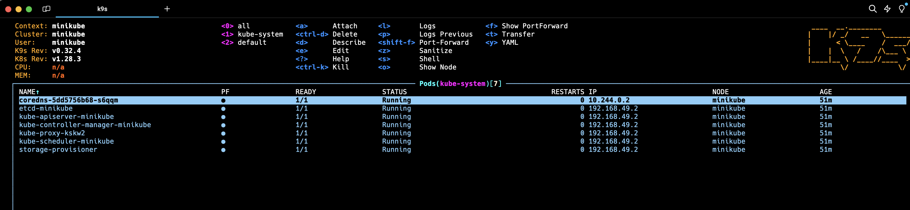

# Minikube

## What is Minikube

Solution to start a Kubernetes (aka. k8s) cluster in local machine

⚠️ TODO: add detail about Minikube architecture ⚠️

### Alternatives solutions

- Kind: https://kind.sigs.k8s.io/
- k3s: https://docs.k3s.io/ (used by Rancher)


## Pre-requisites

Minikube will require `kubectl`. Minikube provide a command `minikube kubectl` that will download `kubectl` if not available.

`kubectl`requires a kubeconfig file to configure the access to the cluster. 

The preference that takes effect while determining which kubeconfig file is used.
1. use --kubeconfig flag, if specified
2. use KUBECONFIG environment variable, if specified
3. use $HOME/.kube/config file

🔴 BE CAREFUL, Minikube will override the `$HOME/.kube/config` file, so if you already have a k8s cluster configured in local, you may need to backup it 🔴

## kubectx / kubens

Tool `kubectx` and `kubens` are useful tool to select cluster and namespace to use by kubectl

**Documentation**: https://github.com/ahmetb/kubectx

```
kubectx minikube
```
is equivalent to 

```
kubectl config use-context minikube
```

`kubectl` command requires to pass the namespace in argument via `-n <my-package>`
It's useful to select the default namespace

```
kubens <namespace>
```
is equivalent to 
```
kubectl config set-context --current --namespace=<namespace>
```

## alias

You may need to create alias to avoid to type `kubectl`. Alias can be added to `$HOME/.zshrc` in order to be available every time you open a zsh terminal (default terminal on MacOS)

```
alias k=kubectl
k get pods
```

## k9s

Spending writing `kubectl` can be cumbersone.
Graphical terminal is available




**Documentation**: https://k9scli.io/


## Setup Minikube

Install Minikube: https://minikube.sigs.k8s.io/docs/start/

Starting a single-node cluster named "minikube" is done with the following command

```
minikube start
```


## Multi-nodes support

By default, Minikube starts a cluster with only one node
```shell
kubectl get nodes

NAME       STATUS   ROLES           AGE   VERSION
minikube   Ready    control-plane   79m   v1.27.13
```

We can choose number of nodes with *--nodes* param
```shell
minikube start --nodes 2
```

### Exercise

Start a 3-nodes clusters and display nodes and inspect one node by using kubectl command. 


## Multi-cluster support

Minikibe allows to define profile (default is name "minikube")
```shell
minikube profile list

|----------|-----------|---------|--------------|------|----------|---------|-------|----------------|--------------------|
| Profile  | VM Driver | Runtime |      IP      | Port | Version  | Status  | Nodes | Active Profile | Active Kubecontext |
|----------|-----------|---------|--------------|------|----------|---------|-------|----------------|--------------------|
| minikube | docker    | docker  | 192.168.49.2 | 8443 | v1.27.13 | Running |     1 | *              | *                  |
|----------|-----------|---------|--------------|------|----------|---------|-------|----------------|--------------------|
```

We can start a new cluster in another profile with *-p* param
```shell
minikube start -p demo
```

Stopping and deleting profile information
```shell
minikube stop -p demo
minikube delete -p demo
```

### Exercise

Start two clusters **demo1** and **demo2** and use *kubectx* command to switch between cluster


# Clean after test

Once the exercises are done, clean your cluster

```shell
minikube stop --all
minikube delete  --all
```