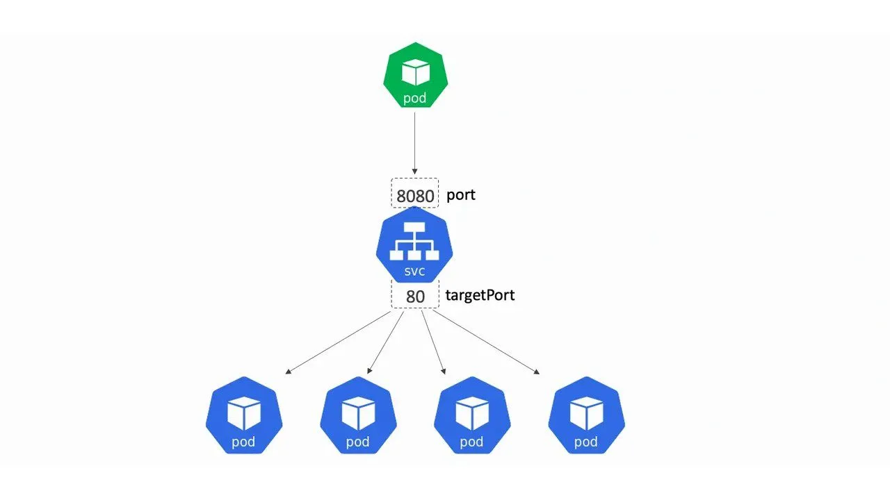
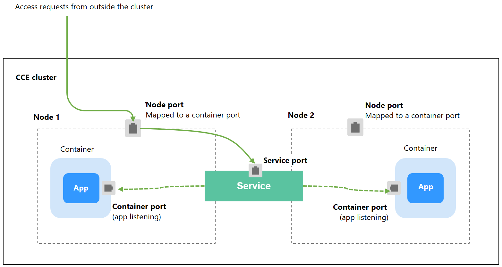

# Service

## 1. What is a Service 

Pods need a way of finding other Pods if they want to consume the services they provide.
We need an additional abstraction in order to achieve this because:
- Pods are by nature ephemeral
- K8s assigns an IP address to a Pod after it has been scheduled to a node and before it’s started. Therefore, Pods don't have a static IP
- Horizontal scaling means multiple pods may provide the same service


A Service is the abstraction we need in order to expose groups of Pods over a network. Each Service has an IP address and port that never change while the service exists.




> [!IMPORTANT]
> The set of Pods targeted by a Service is usually determined by a **selector** that you define. There is no link between a Service and a Deployment objects.

Example
```yaml
apiVersion: v1
kind: Service
metadata:
  name: my-service
spec:
  selector:
    app.kubernetes.io/name: MyApp     # match the pod label
  ports: 
    - protocol: TCP
      port: 80            # port exposed by the service
      targetPort: 9376    # port of the pods targeted by the service. If not specified, it defaults to the value specified in port.
```

Creating a Service leads to add an entry in the internal k8s DNS named **coreDNS**

Host format: `<service-name>.<namespace>.svc.<cluster-domain>`:
- namespace: if omitted, will try with the pod's namespace or with "default" namespace
- svc: denotes that this is a Service
- cluster-domain: in Minikube, it's always "cluster.local". Can be different in other cluster. 

**Resources**:
- https://kubernetes.io/docs/concepts/services-networking/service/
- Service spec: https://kubernetes.io/docs/reference/kubernetes-api/service-resources/service-v1/

## 2. Test environment

The test environment will be the same as the lab about the workload 

All practical works will done within the namespace `workload`


## 3. ClusterIP service

This is the default Service type. It assigns IP address from a pool of IP that your cluster has reserved for that purpose.

Its job is to provide a stable IP and port that passes traffic to Pods/containers on the same cluster. 
The stable IP and port are only accessible from other Pods running in the cluster. 


## 3.1 Exercise

**Create the Service using `kubectl expose` command**
```shell
kubectl expose deploy app --port=8080 --target-port=80 --name=app-service
```

**Create the Service using k8s manifest** (delete first the one created by the expose command)
```shell
kubectl delete svc app-service
kubectl apply -f service.yaml
```

**get and describe a service**
```shell
kubectl get svc
kubectl describe svc app-service
```

We will use a temporary pod to test the connection
```shell
kubectl run -it --rm --restart=Never busybox --image=busybox sh
```

k8s will inject the IP address of the Services as env variable in each pod
```shell
/ # env | grep APP_SERVICE
APP_SERVICE_PORT_8080_TCP_ADDR=10.105.184.42
APP_SERVICE_SERVICE_HOST=10.105.184.42
APP_SERVICE_PORT_8080_TCP_PORT=8080
APP_SERVICE_PORT_8080_TCP_PROTO=tcp
APP_SERVICE_SERVICE_PORT=8080
APP_SERVICE_PORT=tcp://10.105.184.42:8080
APP_SERVICE_PORT_8080_TCP=tcp://10.105.184.42:8080
```

k8s will also modify the `/etc/resolv.conf` file for DNS resolution.

In the following example, the subdomain `workload.svc.cluster.local` has been added, so that the container will perform DNS resolution for the host `app-service.workload.svc.cluster.local`
```shell
/ # more /etc/resolv.conf
nameserver 10.96.0.10
search workload.svc.cluster.local svc.cluster.local cluster.local neptune.dkcorp.net venus.dkcorp.net saturn.dkcorp.net
options ndots:5
```

Any DNS query performed by a process running in a pod will be handled by Kubernetes’ own DNS server.


**Test the service by starting a Pod** 
```shell
wget -O- http://app-service.workload:8080/test.html
```

The following hosts are valid for our `app-service` Service
- *app-service*: only when client Pod is in the same namespace as the target Service
- *app-service.workload*: when Pod is located in another namespace
- *app-service.workload.svc*
- *app-service.workload.svc.cluster.local*


## 4. NodePort service

As mentionned in previous section, ClusterIP service is only accessible inside the k8s cluster
There are multiples options to make services available externally. 
We will see the two options:
- NodePort: current section
- Ingress: see **02-ingress** part



As each node exposes the node port, we have to use external load balancer in order to balance the request between the nodes.


### 4.1. Exercise

**Delete existing service**
```shell
kubectl delete svc app-service
```

**Convert the service to NodePort**
```yaml
spec:
  selector:
  ports:
  type: NodePort
```

**Apply the change**
```shell
kubectl apply -f service.yaml
```

**Check the service**
Connect into a node and curl the URL `http://<ip>:<port>/test.html`
```shell
# Display service to get the port that has been assigned by the k8s API server (here 31885)
kubectl get svc app-service
NAME          TYPE       CLUSTER-IP      EXTERNAL-IP   PORT(S)          AGE
app-service   NodePort   10.106.231.71   <none>        8080:31885/TCP   20m

# Node IP can be found with get nodes command
kubectl get nodes -o wide
NAME       STATUS   ROLES           AGE   VERSION    INTERNAL-IP    EXTERNAL-IP   OS-IMAGE             KERNEL-VERSION     CONTAINER-RUNTIME
prod       Ready    control-plane   21h   v1.27.13   192.168.49.2   <none>        Ubuntu 22.04.4 LTS   6.5.0-15-generic   docker://26.0.1
prod-m02   Ready    <none>          21h   v1.27.13   192.168.49.3   <none>        Ubuntu 22.04.4 LTS   6.5.0-15-generic   docker://26.0.1
prod-m03   Ready    <none>          21h   v1.27.13   192.168.49.4   <none>        Ubuntu 22.04.4 LTS   6.5.0-15-generic   docker://26.0.1

#SSH into a node
minikube ssh -p prod

#cURL the service for each IP
curl http://192.168.49.2:31885/test.html
curl http://192.168.49.3:31885/test.html
curl http://192.168.49.4:31885/test.html
```


## 5. Troubleshoot service

> [!NOTE]
> Debugging Services can be challenging. For example, when we cannot reach the Pods targeted by the Service  


Contrary to a Pod, a Service is not implemented as a process. The **kube-proxy** process is responsible of handling the Service object.
**kube-proxy** is a DaemonSet; that's why, we have one instance per node.

Depending on the **kube-proxy** configuration, it will either use **iptables** or **IPVS** to configure the Network Address Translation (NAT).


TODO
