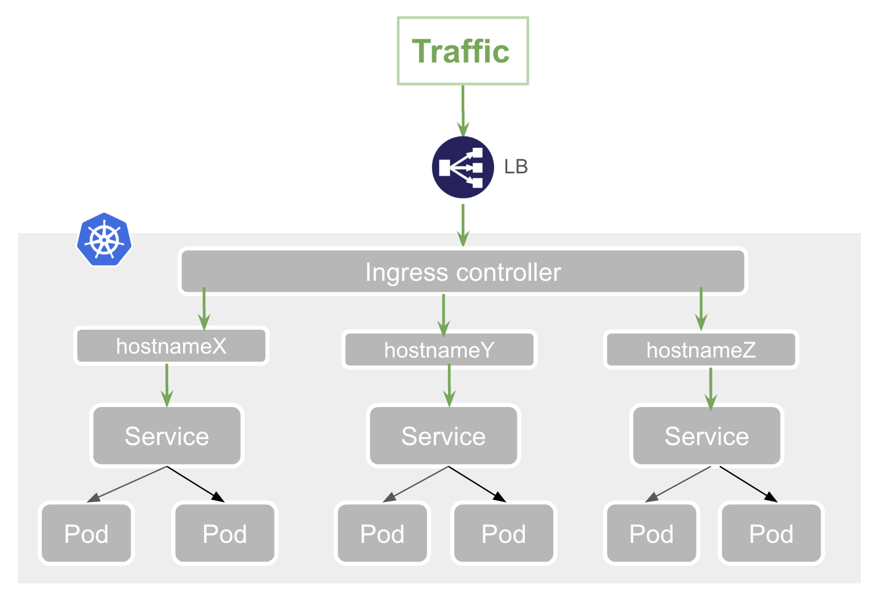

# Ingress

## 1. What is an Ingress

Ingress exposes HTTP and HTTPS routes from outside the cluster to services within the cluster. 
Traffic routing is controlled by rules defined on the Ingress resource.

> [!NOTE]
> Ingress API is frozen. It will be replaced by a new API named [Gateway](https://kubernetes.io/docs/concepts/services-networking/gateway/)



An Ingress resource comes together with an **Ingress controller**. 
An Ingress controller is responsible for fulfilling the Ingress, usually with a load balancer. 
Solution for **Ingress controller** depends on the platform on which the cluster is deployed. 

See https://cloud.google.com/kubernetes-engine/docs/concepts/ingress for more info about Ingress in Google Kubernetes Engine.


## 2. Test environment

Use the same environment as the lab about services

All practical works will done within the namespace `workload`


## 3. Setup Ingress


```shell
minikube addons enable ingress -p prod
```

This will add a new namespace `ingress-nginx`

```shell
kubectl get all -n ingress-nginx
NAME                                            READY   STATUS      RESTARTS   AGE
pod/ingress-nginx-admission-create-xqxxb        0/1     Completed   0          96s
pod/ingress-nginx-admission-patch-qb4qw         0/1     Completed   0          96s
pod/ingress-nginx-controller-6854d97dc8-62nfz   1/1     Running     0          96s

NAME                                         TYPE        CLUSTER-IP      EXTERNAL-IP   PORT(S)                      AGE
service/ingress-nginx-controller             NodePort    10.110.149.57   <none>        80:31728/TCP,443:30273/TCP   96s
service/ingress-nginx-controller-admission   ClusterIP   10.99.221.54    <none>        443/TCP                      96s

NAME                                       READY   UP-TO-DATE   AVAILABLE   AGE
deployment.apps/ingress-nginx-controller   1/1     1            1           96s

NAME                                                  DESIRED   CURRENT   READY   AGE
replicaset.apps/ingress-nginx-controller-6854d97dc8   1         1         1       96s

NAME                                       COMPLETIONS   DURATION   AGE
job.batch/ingress-nginx-admission-create   1/1           16s        96s
job.batch/ingress-nginx-admission-patch    1/1           16s        96s
```


### 3.1. Exercise

Create the Ingress 

```shell
kubectl apply -f ingress.yaml
```